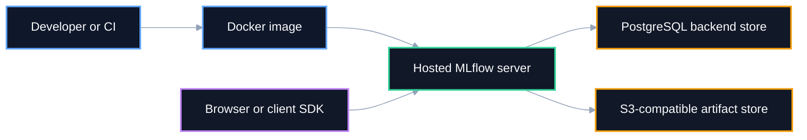
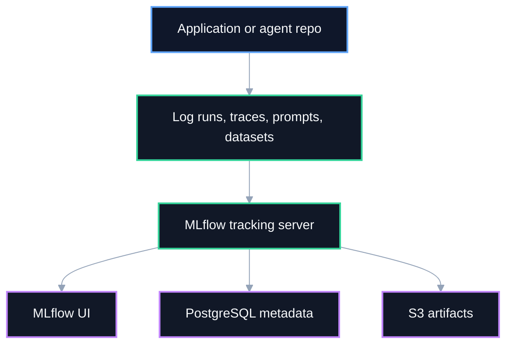

# MLflow Tracking Server

<p align="center">
  <a href="https://mlflow.org/">
    
  </a>
  <a href="https://job.oploy.eu/">
    
  </a>
</p>


Containerized MLflow tracking server deployment with PostgreSQL-backed metadata and optional S3-compatible artifact storage.

> ⭐ If this repository is useful for your work or research, consider starring it to support visibility and future development.

This project exists because local MLflow is often not enough once experiments become heavier. A self-hosted server gives you a persistent web UI, cleaner experiment management, shared access, better PostgreSQL-backed metadata support, and less local machine clutter from artifacts and databases.

[](https://railway.com/deploy/mlflow-full?referralCode=00VX20&utm_medium=integration&utm_source=template&utm_campaign=generic)

Referral link for Railway credits:

- https://railway.com?referralCode=00VX20

## Why this repository exists

MLflow can run locally with `mlflow ui`, but local usage becomes limiting when you need:

- a persistent tracking server accessible from multiple projects
- PostgreSQL-backed experiment metadata instead of local SQLite constraints
- cleaner artifact management via S3-compatible storage
- fewer local resource issues related to storage, RAM usage, and clutter
- a hosted UI for prompt optimization, tracing, and experiment review

This repository captures the deployment shape used to support MLflow-based optimization and observability for companion projects such as AI agent backends.

## Core use cases

- host a shared MLflow server for experiment tracking
- support GenAI tracing, prompt registry, and prompt optimization workflows
- persist experiment metadata in PostgreSQL
- persist artifacts in S3-compatible object storage
- avoid messy local MLflow state and large artifact folders

## Architecture

The following two diagrams serve different purposes:

- **Deployment architecture overview** shows the infrastructure pieces needed to run MLflow reliably.
- **Usage workflow overview** shows how related application repositories interact with the tracking server.

### 1. Deployment architecture overview

This diagram explains the recommended hosted shape for the MLflow server.



### 2. Usage workflow overview

This diagram focuses on how MLflow is used by related app repositories and optimization workflows.



## What makes hosted MLflow useful here

For this project family, hosted MLflow helps because:

- it stores experiment metadata in PostgreSQL, which is better suited for richer experiment data than local SQLite
- it keeps artifacts outside the local machine
- it allows you to turn the server on only when needed
- it gives a central UI for prompt optimization, evaluation, feedback, and traces

The deployment cost pattern described by the project owner is roughly:

- PostgreSQL on Railway: very low monthly cost
- S3 artifact storage: usually minimal cost at small scale
- MLflow runtime server: the main recurring cost

Operational note:

- if you want to pause the server on Railway, you can use a sleep-based custom start command such as `sleep infinity` when you intentionally want the service idle

## Artifact storage

By default, artifacts written inside the container are **not persistent**.

Without object storage, artifacts end up under:

```text
/app/mlruns
```

That means redeploys or restarts can lose locally stored artifacts.

For a better production experience, configure an S3-compatible bucket using:

```env
BACKEND_S3=s3://mlflow-artifacts/
AWS_ACCESS_KEY_ID=
AWS_SECRET_ACCESS_KEY=
AWS_DEFAULT_REGION=
```

This repository’s container startup uses:

```text
--default-artifact-root ${BACKEND_S3:-$BACKEND_s3}
```

So if `BACKEND_S3` is defined, MLflow will use that persistent object store automatically.

## Deployment files

Current deployment runtime is defined in [`Dockerfile`](MLflow%20server%20(appropriate%20name)/Dockerfile:1).

The image uses:

- `ghcr.io/mlflow/mlflow:v3.10.1-full`
- a hosted MLflow server process on port `8080`
- PostgreSQL via `BACKEND_STORE_URI`
- optional object storage via `BACKEND_S3`

## Quick start

### 1. Prepare environment variables

Copy [`.env.example`](MLflow%20server%20(appropriate%20name)/.env.example) and set:

- `BACKEND_STORE_URI`
- optional `BACKEND_S3`
- optional AWS credentials for artifact storage

### 2. Build and run locally

```powershell
docker build -t mlflow-tracking-server .
docker run --rm -p 8080:8080 --env-file .env mlflow-tracking-server
```

### 3. Open MLflow UI

```text
http://localhost:8080
```

## Railway deployment notes

This repository is intentionally compatible with a simple hosted deployment model such as Railway.

Recommended production setup:

1. add a PostgreSQL service for `BACKEND_STORE_URI`
2. add an optional S3-compatible bucket for persistent artifacts
3. deploy this containerized MLflow service
4. expose the public MLflow UI URL to companion repositories through environment variables like `MLFLOW_TRACKING_URI`

## Companion guidance

This repository also contains guidance material derived from the MLflow workflows used in [`job-agent-backend`](job-agent-backend). Those documents are included here so MLflow server usage and MLflow workflow guidance live closer to the tracking-server deployment itself.

See:

- [`docs/JOB_AGENT_BACKEND_MLFLOW_GUIDE.md`](MLflow%20server%20(appropriate%20name)/docs/JOB_AGENT_BACKEND_MLFLOW_GUIDE.md)
- [`docs/MLFLOW_SERVER_DEPLOYMENT_GUIDE.md`](MLflow%20server%20(appropriate%20name)/docs/MLFLOW_SERVER_DEPLOYMENT_GUIDE.md)
- [`scripts/test-mlflow.py`](MLflow%20server%20(appropriate%20name)/scripts/test-mlflow.py)

## Project structure

```text
.
├── docs/
│   ├── JOB_AGENT_BACKEND_MLFLOW_GUIDE.md
│   └── MLFLOW_SERVER_DEPLOYMENT_GUIDE.md
├── scripts/
│   └── test-mlflow.py
├── .env.example
├── .gitignore
├── AGENTS.md
├── Dockerfile
├── LICENSE
└── README.md
```

## Recommended public repository name

Recommended GitHub repository name: **`mlflow-tracking-server`**

Alternative acceptable names:

- `mlflow-railway-server`
- `self-hosted-mlflow-server`
- `mlflow-server-deployment`

## SEO and discoverability

This repository is intentionally documented with search-friendly terms such as:

- MLflow tracking server
- Railway MLflow deployment
- self-hosted MLflow with PostgreSQL
- MLflow with S3 artifact storage
- prompt optimization and GenAI experiment tracking

These terms help both search engines and LLM-based discovery systems understand the repository purpose.

## License

This repository is licensed under the MIT License. See [`LICENSE`](MLflow%20server%20(appropriate%20name)/LICENSE).
